<p align="center">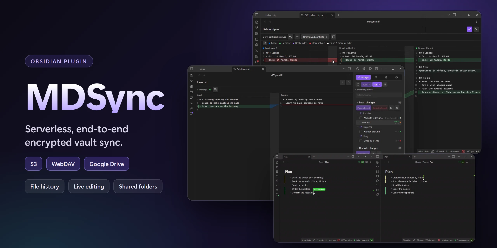</p>

<p align="center">
  <a href="https://github.com/k1tbyte/mdsync/releases/latest"></a>
  <a href="LICENSE"></a>
</p>

<p align="center">
  <a href="#features">Features</a> ·
  <a href="#quick-start">Quick start</a> ·
  <a href="#privacy-and-network">Privacy</a> ·
  <a href="#self-hosting-the-relay">Relay</a>
</p>

MDSync syncs your vault through an S3 bucket, a WebDAV server or Google Drive. There is no MDSync server: your devices talk straight to your storage, and everything they upload is encrypted on the device with a key derived from your passphrase. The provider stores only encrypted data. Sync is manual until you turn on automation, so you can review each change before it leaves the device. An optional relay, a Cloudflare Worker you deploy to your own account, adds instant sync, live editing and shared folders.

## Features

**Sync**

- [Storage you choose](#storage): any S3-compatible service, WebDAV or Google Drive.
- [Encryption](#encryption): file contents and the file list, with a passphrase that never leaves your devices.
- [Source control view](#source-control-view): local changes, remote changes and conflicts, with a diff for every file.
- Manual push and pull, or [automatic sync](#automatic-sync) on a timer and after edits.
- [Conflict resolution](#conflicts): automatic merge, a three-way merge editor, or pick a side.
- Renames and moves sync as moves.
- [Change marks in the editor](#change-marks-in-the-editor) for lines changed since the last sync.
- [Ignore rules](#ignore-rules): a shared `syncignore.md`, patterns per device, symlinks and a size limit.
- [Obsidian settings sync](#obsidian-settings-sync): hotkeys, plugins, snippets and themes, per device.

**History**

- [File history](#file-history): every saved version of a note, diffed against the current one.
- [Timeline](#timeline): every push, and putting the whole vault back to one of them.
- [Deleted files](#deleted-files): restore anything history still holds.

**Real time** (needs the [relay](#self-hosting-the-relay))

- Your other devices pull the moment you push.
- [Live editing](#live-editing): notes and Excalidraw drawings edit together, keystroke by keystroke.
- [Presence](#presence): who has which note open, and following someone through the vault.
- [Shared folders](#shared-folders): share a folder with other people without handing them your storage keys.
- [Share links](#share-links): publish one note as a link anyone can read, with an optional passphrase, a view limit and an expiry.

**Setup and upkeep**

- [Device transfer](#device-transfer): move your setup to a new device with an encrypted link or QR code.
- Integrity check of the remote, and cleanup of objects nothing references.
- Remote reset that rebuilds the remote from this vault (you type `RESET` to confirm).
- A local diagnostics log in the settings, never synced.

## Quick start

1. Install MDSync from **Settings → Community plugins** and enable it.
2. Open **Settings → MDSync**, pick a storage backend and fill in its fields.
3. Run **MDSync: Compare with remote** and choose a passphrase (12 characters or more).
4. Run **MDSync: Push all local changes** for the first upload.
5. On the next device, import the setup with a [transfer link](#device-transfer) or enter the same storage and passphrase, then pull.

> **Tip: Cloudflare R2 is an easy S3-compatible backend.** Its free tier (10 GB, 1 million write and list requests and 10 million read requests a month) covers most vaults, downloads cost nothing, and it supports the conditional writes MDSync relies on. Enable R2 on your Cloudflare account, create a bucket, and create an API token with **Object Read & Write** limited to that bucket. R2 shows the access key ID and secret only once. In MDSync pick S3-compatible and set **Endpoint** to `https://<ACCOUNT_ID>.r2.cloudflarestorage.com` (`https://<ACCOUNT_ID>.eu.r2.cloudflarestorage.com` for a bucket created in the EU jurisdiction), leave **Region** as `auto`, and fill in the bucket and the token's keys. The same Cloudflare account can host the [relay](#self-hosting-the-relay).

Give each vault its own bucket prefix. MDSync refuses a prefix that already holds another vault.

Set up the first device alone and let its first sync finish. That sync creates the vault's key. On storage without conditional writes (Google Drive, some WebDAV and S3-compatible servers), two devices starting at the same moment can each create one, and files encrypted by one become unreadable to the other.

## Sync

### Storage

| Backend | Fields | Notes |
| --- | --- | --- |
| S3-compatible | Endpoint, region, bucket, prefix, access key, optional path-style URLs | Required to own a shared folder. |
| WebDAV | Base URL, path, username, password | |
| Google Drive | Folder name, auth server URL | Needs your own [relay](#self-hosting-the-relay) for the sign-in. Best effort: Drive has no conditional writes, so two devices writing the same new object at once can leave two files with one name. |

### Encryption

The file list and every file are encrypted with a key derived from your passphrase. The passphrase itself is never uploaded.

- **Cache passphrase between launches** keeps it on the device, so you are not asked at every start. **MDSync: Forget cached passphrase** clears it.
- **Rotate passphrase** re-wraps the vault's data key under a new passphrase. Notes are not re-encrypted, so it is instant. Every device has to switch to the new passphrase afterwards.

### Source control view

The panel has four tabs: **Changes**, **History**, **Timeline** and **Deleted**.

**Changes** lists local changes, remote changes and conflicts, with a path filter. Open any file for a side-by-side diff (combined on narrow screens or on request). In a text file you can revert a single local change or accept a single remote one, then apply your choices. Binary files show the size change instead, with **Show differences anyway** where the file can be read as text.

<details open>
<summary>Demo</summary>

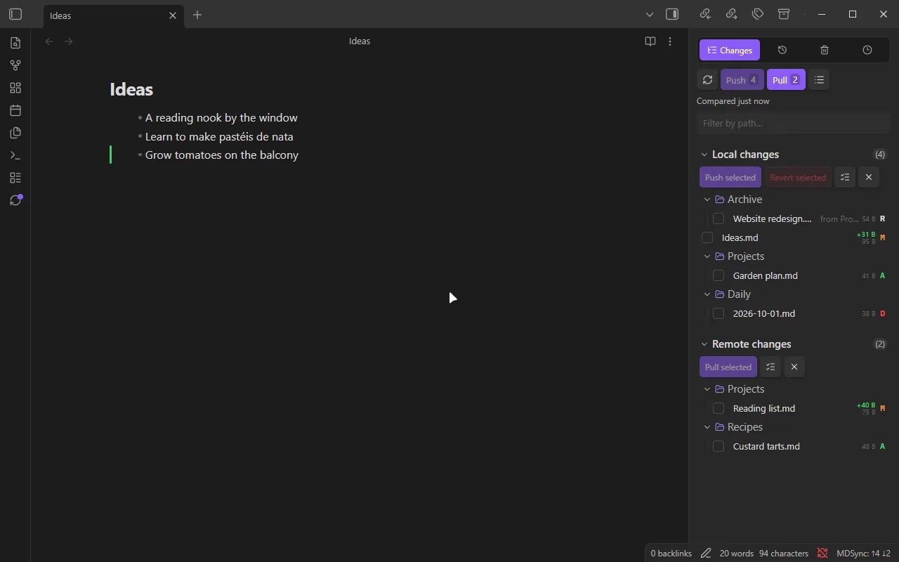

</details>

### Automatic sync

Sync is manual by default. In **Settings → MDSync → Sync** you can turn on:

- **Autosync**: compare, pull and push every few minutes.
- **Push after changes settle**: push once the vault has been quiet for a set delay. It never pulls, so conflicts and incoming changes wait for you.
- **Push after successful pull**.

### Conflicts

A conflict is a file changed both here and on the remote. For each one you can **Keep local**, **Accept remote**, **Keep both versions** (the remote copy lands next to yours as `todo (conflict from Phone 2026-07-05).md`) or **Merge…**.

**Merge…** opens a three-way editor: your version, the result and the remote version side by side. Changes that do not overlap are merged up front, and you review and save. Autosync merges such conflicts on its own and leaves the rest to you.

<details open>
<summary>Demo</summary>

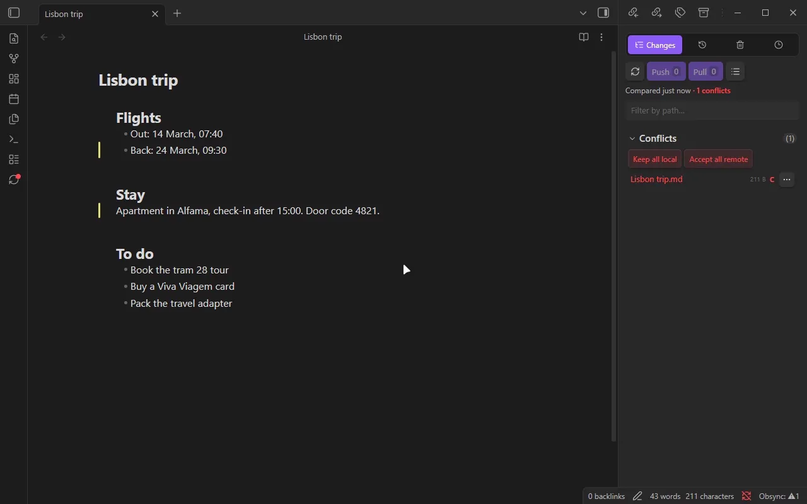

</details>

### Change marks in the editor

The gutter marks lines added, changed or removed since the last sync. Click a mark to see the old text and revert that change.

<details>
<summary>Demo</summary>

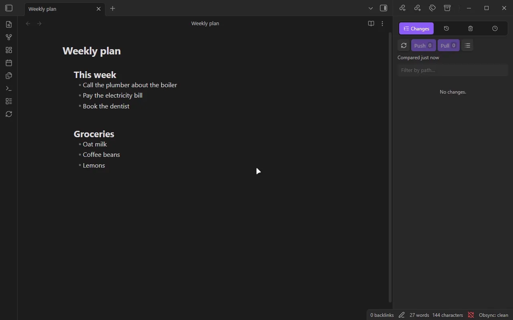

</details>

### Ignore rules

Both sources use gitignore syntax:

- `syncignore.md` in the vault root syncs like a normal note, so every device follows it. A shared folder has its own in its root.
- **Device-local exclusions → Patterns** applies to this device only.

```gitignore
drafts/
*.tmp
README.md
```

Ignoring never deletes anything: a matching file stops syncing, and copies on the remote and other devices stay. To remove a file everywhere, delete it first and then ignore it.

**Ignore symlinks** (on by default) skips symbolic links and Windows junctions, which Obsidian shows as ordinary folders. **Max file size** skips anything larger.

### Obsidian settings sync

Under **Obsidian configuration scope** you choose what else to sync: core settings, hotkeys, the list of enabled plugins, plugins with their settings, CSS snippets and themes. Every category is off by default and chosen per device. Turning one off deletes nothing. **Clear on remote** removes a category from the remote without touching local files. MDSync's own plugin folder never syncs.

## History

Every push records what it changed. **Versions to keep** sets how many pushes history holds; pinned versions are kept until you unpin them.

### File history

The **History** tab lists the open file's past versions. Click one to diff it against the current file, or use its menu to restore it, compare it with the version before, or pin it under a name. A restore always shows the diff first.

<details>
<summary>Demo</summary>

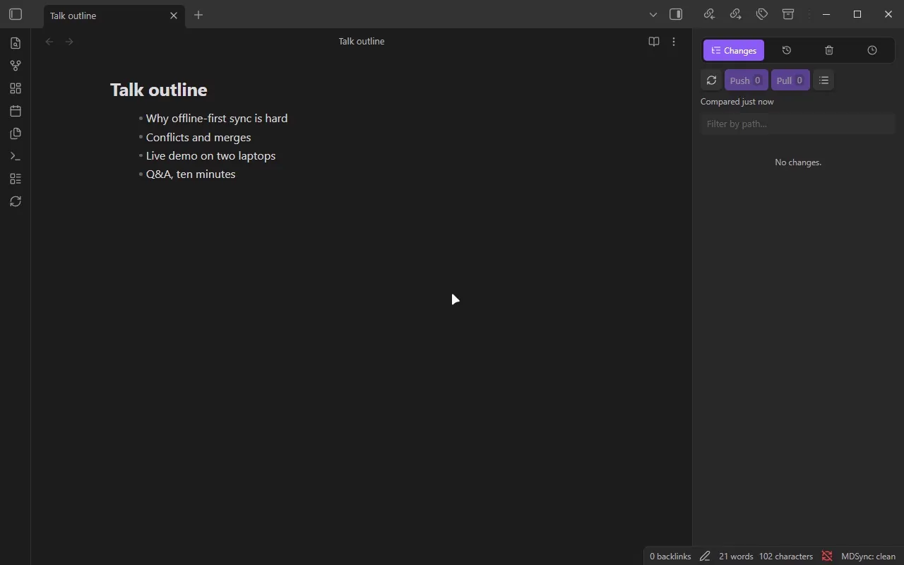

</details>

### Timeline

The **Timeline** tab lists every push to the vault with the files it changed. From any of them you can see its changes or put the whole vault back to that point.

<details>
<summary>Demo</summary>

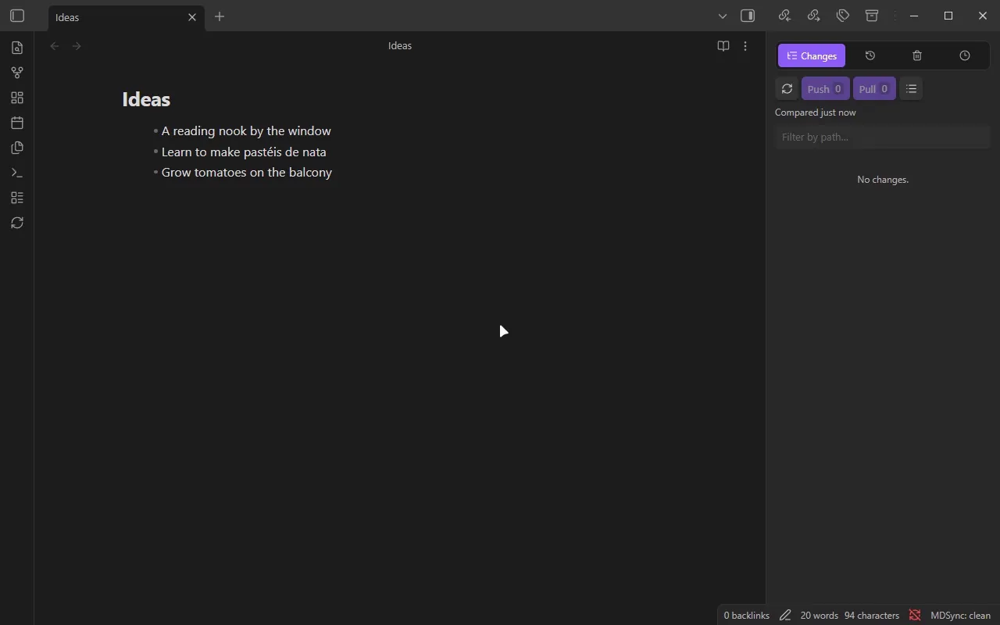

</details>

### Deleted files

The **Deleted** tab (or **MDSync: Restore deleted files**) lists files gone from the vault that history still holds: when each went, which device removed it, and how many more pushes the record survives. **Restore** puts a file back where it was, **Restore to…** somewhere else. Pin a version to keep a deleted file for good.

<details>
<summary>Demo</summary>

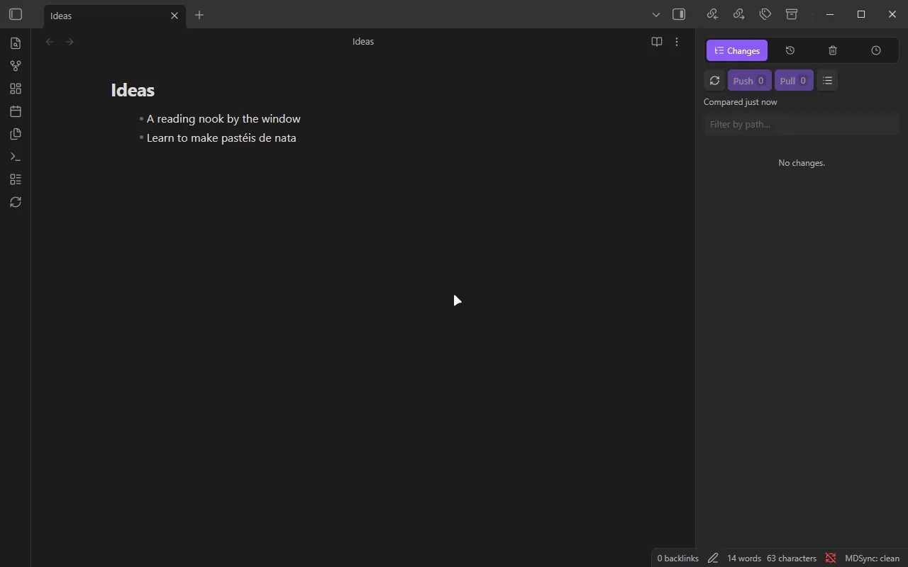

</details>

## Real time

These features run through the [relay](#self-hosting-the-relay). Turn them on with **Real-time sync** and **Live editing**. If the relay is down, devices fall back to periodic sync.

### Live editing

A note open on two devices edits together, keystroke by keystroke, with the other person's cursor. It works between your own devices and with the people in a shared folder. Excalidraw drawings sync the same way (Excalidraw plugin 2.x).

- **Show who typed what** tints text by the person who typed it.
- If someone deletes a note you have open, MDSync asks whether to delete it here too or bring it back everywhere.

<details open>
<summary>Demos</summary>

**Two people in one note**: typing at once, cursors with names, text tinted by author, then one push and one pull.

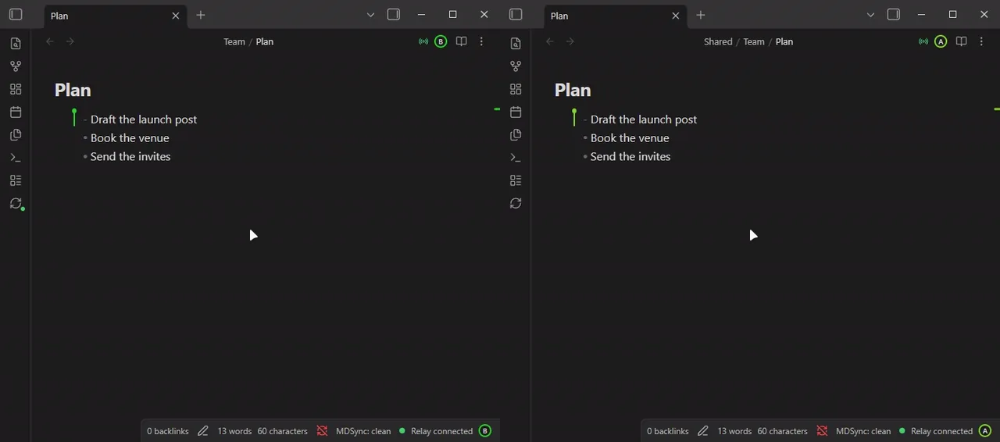

**Excalidraw**: two people draw on one canvas, each seeing the other's pointer and shapes.

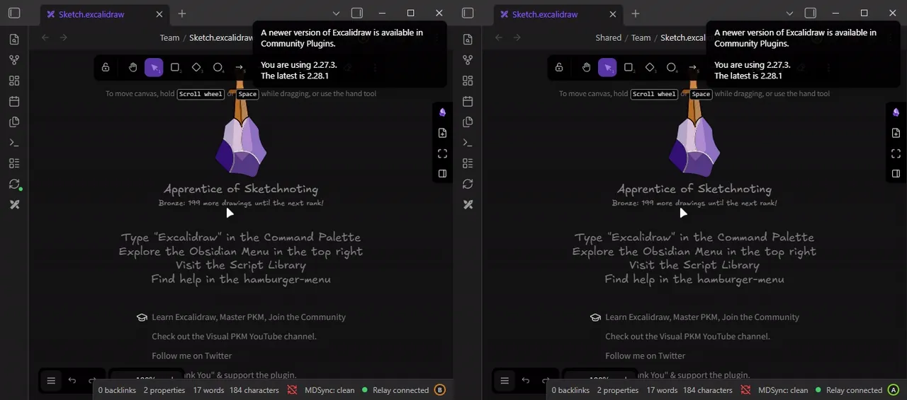

</details>

### Presence

The note header shows who else has the note open, as coloured initials. Click one to follow that person: your tab opens the notes they open and keeps their cursor in view. The file explorer shows headcounts on shared folders and a dot on files others changed that you have not opened yet. On desktop, the status bar shows the relay state.

**Show my open note to others** off keeps you online without showing where you are.

<details>
<summary>Demos</summary>

**Who is where**: people in the explorer and the note header, and a dot on what someone else changed.

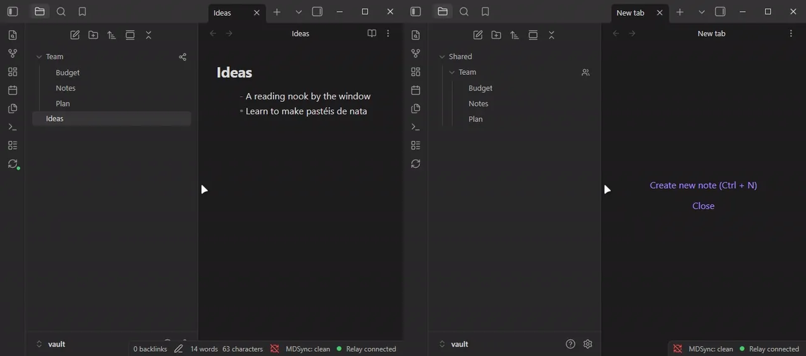

**Following**: one person follows another from note to note, their view going where the other types.

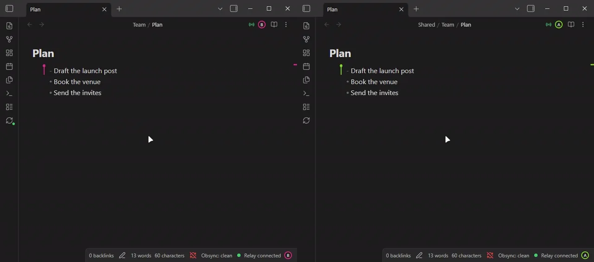

</details>

### Shared folders

Share a folder from its menu in the file explorer. Owning a share needs S3-compatible storage, and sending invites needs the relay.

1. **Invite** gives you an `obsidian://mdsync-share` link and a password. Send them separately.
2. The other person opens the link (or pastes it in **Accept an invite**), enters the password and picks an empty folder. They need no storage of their own and never see your credentials.
3. A **read-only** invite pulls changes but can never push.

From the share's window you can see who is in it, revoke a person, pause the share on this device or on all your devices, and stop sharing. When a share ends, its files stay and sync with your vault again. Renaming a shared folder renames it on your other devices too.

<details open>
<summary>Demos</summary>

**Invite**: share a folder from the explorer, send the link and password, the guest joins it.

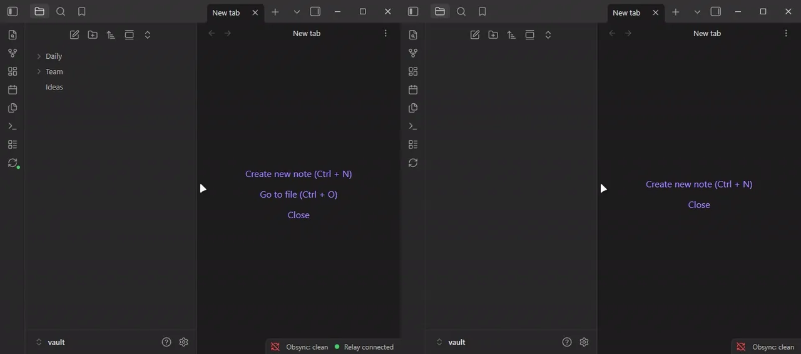

**Read-only invite**: the lock, the owner's edits arriving live, a note deleted elsewhere, revoking access.

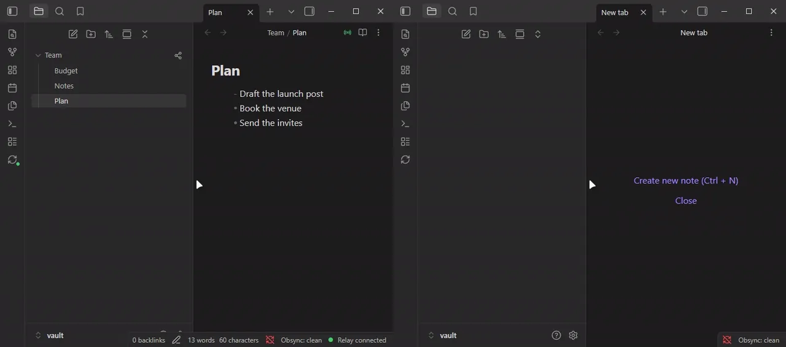

</details>

### Share links

Publish one note as a link anyone can open in a browser with nothing installed, from its menu in the file explorer (**MDSync: Share link**) or with **Share this note as a link**. It needs the relay, which serves the page.

<details open>
<summary>Demo</summary>

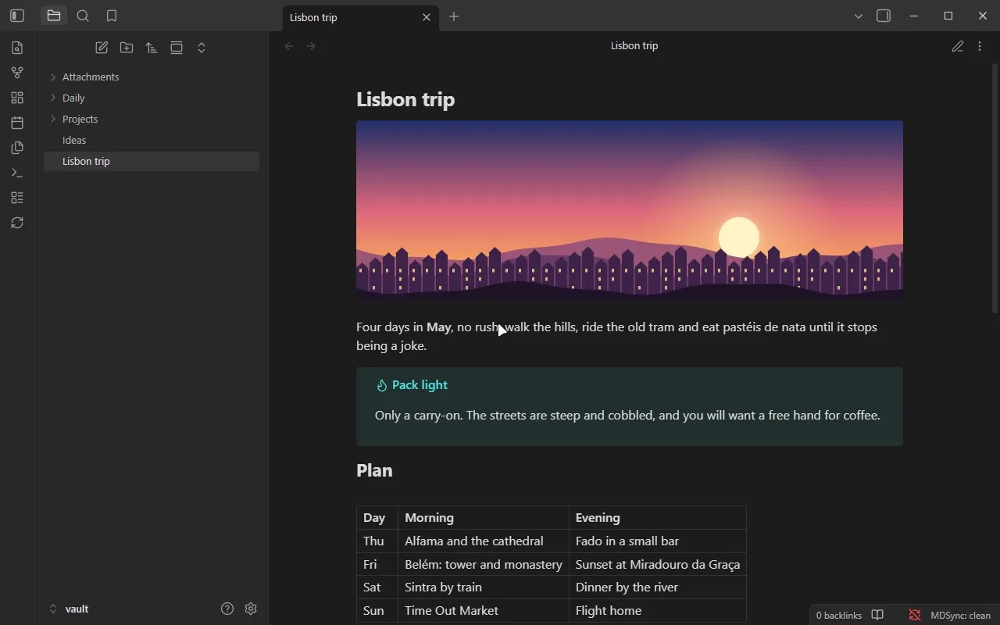

</details>

- **Expires** (5 minutes to 30 days, an exact date, or never), **Views** and an optional **passphrase** limit who can read it and for how long. Once the time or the views run out, the relay erases the note.
- The note is drawn as Obsidian's reading view draws it, then encrypted on your device. The key is in the part of the link after `#`, which browsers never send, so the relay holds only ciphertext.
- The page has an outline, folding headings, copyable code, wide text and **Copy as Markdown**.
- Left out: properties, comments, links to other notes (their text stays) and embedded notes. Vault images are embedded and shrunk; **Include images** turns that off. The window lists what was left out before you create the link.
- **Manage share links** shows the views left, copies the link, **Update**s it to the note as it is now (same link) or stops it at once. A globe in the file tree and in the note's header marks a shared note; a dot means it changed since.

A link is a copy: later edits do not reach it until you update it. Anyone who has the link (and the passphrase) can read the note and pass it on. The links, with their keys, are kept in the plugin's `data.json`.

## Device transfer

**Settings → MDSync → Connection → Export setup** creates an encrypted link and QR code with your main sync settings, storage credentials included. It leaves out the cached passphrase and display preferences. The link is encrypted with your passphrase, so the new device needs the same passphrase and confirms the import before anything is applied.

<details open>
<summary>Demo</summary>

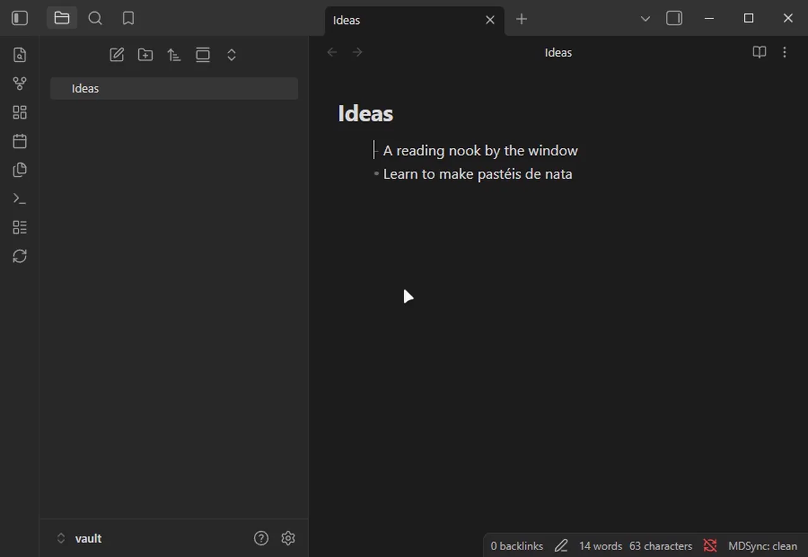

</details>

<details>
<summary>All commands</summary>

- **Compare with remote**: refresh sync status and open the source control view.
- **Refresh sync status**: compare only.
- **Push all local changes** / **Pull all remote changes**.
- **Open source control**.
- **Open diff for active file**.
- **Show file history**.
- **Restore deleted files**.
- **Verify remote integrity**: check that every object the remote file list names exists.
- **Deep-clean orphaned objects**: delete remote objects nothing references.
- **Reset remote storage**: delete the remote file list, file contents, history and pins, then show local files as new. The key and salt stay, so your passphrase keeps working.
- **Forget cached passphrase**.
- **Manage sharing**: the sharing window of the open file's shared folder.
- **Accept shared folder invite**.
- **Share this note as a link** / **Update share links of this note** / **Manage share links**.
- **Show relay status**: relay state per space and who is in shared notes.
- **Show live menu of this note**.
- **Toggle authors in live notes**.
- **Rebuild live note**: restart the open live note's room from its current text, dropping its edit history.

</details>

## Privacy and network

MDSync has no telemetry. It connects only to:

- **Your storage** (S3 endpoint, WebDAV server or the Google Drive API), which gets encrypted files and the encrypted file list.
- **Your relay**, if you set one up. It is a Cloudflare Worker you deploy to your own account.

You need an account with your storage provider. The relay needs a Cloudflare account, and Google Drive needs your own Google Cloud OAuth client.

Storage credentials, share keys and the relay secret are stored in the plugin's `data.json` on each device, like other plugins' settings. Diagnostics logs stay on the device and never sync.

**What the relay sees.** It never sees file contents, file names or keys: live edits and presence travel encrypted under each space's key. It does see a hash of your storage identity, a device id per connection, and when each sync and note switch happens. For a shared folder with participants, it keeps your S3 access key in its storage to sign requests for them, plus the names you invited people by. With Google Drive, it exchanges your sign-in for tokens and sees your Drive refresh token.

**Share links.** Creating one sends a rendered copy of that note to your relay, encrypted on your device. The relay stores the ciphertext, a fingerprint of the passphrase check, the view limit and the expiry, and counts views. It never sees the key (it stays in the part of the link after `#`), the passphrase, or the text. The page a recipient opens is served by your relay and decrypts in their browser.

<details>
<summary>What MDSync writes to your storage</summary>

```text
<prefix>/manifest.json.enc        encrypted file list
<prefix>/history.json.enc         encrypted change log, one entry per push
<prefix>/salt.bin
<prefix>/keys.json                vault key wrapped by your passphrase
<prefix>/objects/<sha256>.enc     encrypted file contents
<prefix>/pins/<id>.json.enc       full file list of a pinned version
<prefix>/spaces/<id>.json.enc     shared folder records
<prefix>/shares/<id>/...          each shared folder's own storage
```

</details>

## Self-hosting the relay

The relay is `packages/relay`: one Cloudflare Worker that handles instant sync, live editing, invites to shared folders, share links and the Google Drive sign-in. It fits in the Workers free tier.

1. Fork this repository.
2. In **Settings → MDSync → Connection → Relay server**, select **Generate**. The secret is copied to your clipboard.
3. In your fork, under **Settings → Secrets and variables → Actions**, add `CLOUDFLARE_API_TOKEN` (the *Edit Cloudflare Workers* template is enough), `CLOUDFLARE_ACCOUNT_ID` and `RELAY_SECRET`.
4. Run the **Deploy Relay** workflow. The run summary shows the worker URL.
5. Paste the URL into **Relay URL** and select **Test**.

<details>
<summary>Google Drive sign-in</summary>

1. In Google Cloud, create an OAuth client of type *Web application* with the redirect URI `https://<your-relay>/auth`, and enable the Google Drive API.
2. Add `GDRIVE_CLIENT_ID` and `GDRIVE_CLIENT_SECRET` to the fork's secrets and run **Deploy Relay** again.
3. In MDSync, set **Auth server URL** to your relay URL and select **Log in**.

While the OAuth consent screen is in testing mode, Google expires refresh tokens after 7 days. Publish it to stay signed in.

</details>

## Development

```bash
pnpm install
pnpm dev        # watch build
pnpm build
pnpm lint
pnpm typecheck
pnpm test
```

The plugin lives in `packages/plugin`, the relay in `packages/relay`, the page share links open in `packages/viewer` (built into the relay's static assets), and the format both share in `packages/protocol`.

## License

[MIT](LICENSE)
